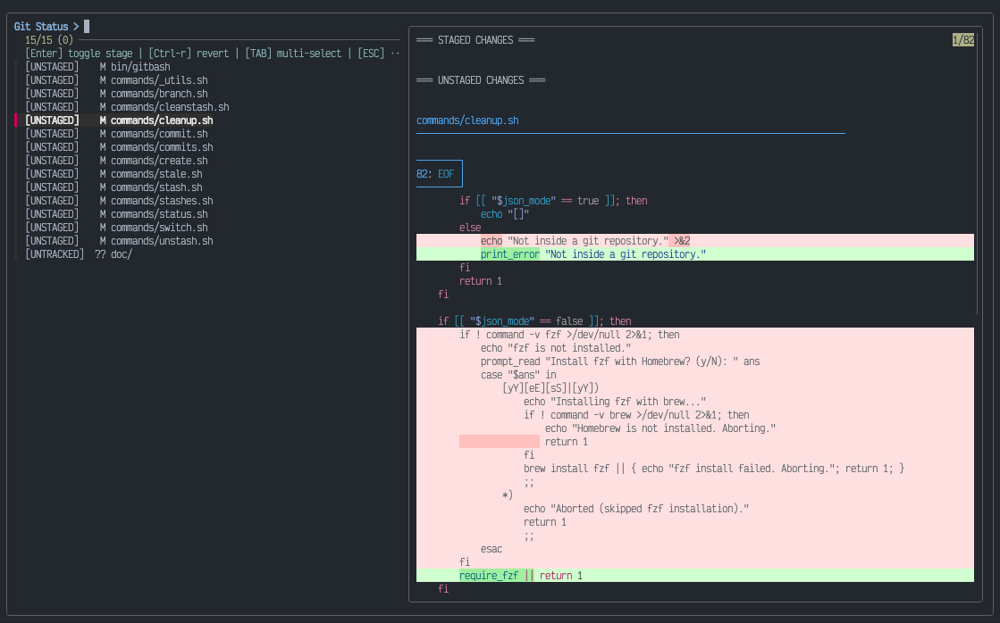

# gitbash

Pure bash, zero-dependency git utilities. Reduce repetitive typing and supercharge git workflows with optional interactive previews and safe cleanup — see a [full comparison](./docs/workflows.md).



## Installation

### Via npm

```bash
npm i -g gitbash && gitbash --config
```

### Via install script (no npm or node needed)

```bash
# curl
curl -fsSL https://raw.githubusercontent.com/jaggli/gitbash/main/install.sh | sh

# wget
wget -qO- https://raw.githubusercontent.com/jaggli/gitbash/main/install.sh | sh
```

This downloads the latest GitHub release to `~/.local/share/gitbash` and links `~/.local/bin/gitbash`. Run `gitbash --update` (or the script again) to upgrade. Options are set as environment variables:

```bash
# Install a specific version
curl -fsSL https://raw.githubusercontent.com/jaggli/gitbash/main/install.sh | GITBASH_VERSION=2.0.1 sh

# Custom locations (e.g. system-wide)
curl -fsSL https://raw.githubusercontent.com/jaggli/gitbash/main/install.sh \
  | sudo GITBASH_INSTALL_DIR=/usr/local/share/gitbash GITBASH_BIN_DIR=/usr/local/bin sh
```

To uninstall, remove `~/.local/share/gitbash` and `~/.local/bin/gitbash`.

### Options

```bash
gitbash --help         # Show help
gitbash --version      # Show version
gitbash --update       # Update to the latest release (npm or install script)
gitbash --init         # Print shell functions (see Shell integration)
gitbash --config       # Interactive configuration wizard
gitbash --config-local # Configure overrides for the current repository (committed)
gitbash --config-user  # Configure personal overrides for the current repository
```

### Dependencies

```bash
# Required
git >= 2.23, bash >= 3.2

# Optional (recommended)
brew install fzf        # Interactive menus and previews (fzf >= 0.36)
brew install git-delta  # Better diff highlighting
brew install bat        # File preview with syntax highlighting
```

### Shell integration

Add to your `.zshrc` or `.bashrc` to call the commands without the `gitbash` prefix:

```bash
eval "$(gitbash --init)"             # commit, switch, status, ...
eval "$(gitbash --init --prefix=gb-)" # gb-commit, gb-switch, ... (avoids shadowing e.g. /usr/bin/pr)
```

This defines small wrapper functions; every command still runs in its own bash process, so nothing else is added to your shell. Individual aliases work too, e.g. `alias commit="gitbash commit"`.

### Windows

gitbash runs in Git Bash (comes with [Git for Windows](https://gitforwindows.org)) and in WSL. Install it from Git Bash with npm or the install script, and the dependencies with `winget install junegunn.fzf dandavison.delta sharkdp.bat` (`gitbash --config` offers this). fzf needs to be 0.54 or newer on Windows; Windows Terminal is recommended.

To use the commands in PowerShell, save the PowerShell functions once (from Git Bash) and load them in your `$PROFILE`:

```bash
gitbash --init --shell=pwsh > ~/gitbash.ps1   # add --prefix=gb- to get gb-switch: switch is a PowerShell keyword
```

```powershell
New-Item -Force -ItemType File $PROFILE   # only if you have no profile yet
Add-Content $PROFILE '. ~/gitbash.ps1'    # new windows get gitbash, commit, status, ... (run with Git's bash)
Set-ExecutionPolicy -Scope CurrentUser RemoteSigned   # Windows PowerShell 5.1 only: it blocks the profile otherwise
```

## Commands

### branch

Interactive menu for branch operations (create/switch/update).

```bash
branch              # Interactive menu
branch -h           # Show help
branch --version    # Show version
```

### create

```bash
create [--feature|--bugfix|--hotfix|--release|-t] [--push|--no-push] [JIRA_LINK|ISSUE] [TITLE...]
```

Create a branch from the latest `origin/<base>` with optional Jira parsing, then push and track it (`GITBASH_CREATE_AUTO_PUSH`, `--no-push`).

**Branch Name Format:** `<type>/<custom-prefix>/<issue>-<title>` or `<type>/<custom-prefix>/<title>`

Issue keys like `PROJ-123`, `AB2-45` or `proj-7`, or a Jira URL. Titles are lower-cased, umlauts and accents transliterated (`Über` → `ueber`).

**Examples with custom prefix** (`GITBASH_CREATE_BRANCH_PREFIX="awesome-team"`):

With issue parsing enabled (default):

```bash
create PROJ-123 fix login bug           # → feature/awesome-team/PROJ-123-fix-login-bug
create fix bug                          # → feature/awesome-team/NOISSUE-fix-bug
create --hotfix PROJ-999 critical fix   # → hotfix/awesome-team/PROJ-999-critical-fix
create                                  # Interactive mode with Jira prompt
```

With issue parsing disabled (`GITBASH_CREATE_NO_ISSUE_PARSING="yes"`):

```bash
create fix login bug                    # → feature/awesome-team/fix-login-bug
create --hotfix enhance security        # → hotfix/awesome-team/enhance-security
create                                  # Interactive mode (no Jira prompt)
```

**Examples with empty prefix** (`GITBASH_CREATE_BRANCH_PREFIX=""`, default):

```bash
create PROJ-123 fix bug                 # → feature/PROJ-123-fix-bug
create fix bug                          # → feature/NOISSUE-fix-bug
create enhance login screen             # → feature/enhance-login-screen (parsing disabled)
```

### switch

```bash
switch [FILTER...]
```

Switch branches with fzf. Shows local branches (`merged:` = fully merged into the base branch), then remote branches without a local copy. Preview shows commit history. Switches directly when the filter is an exact branch name or matches exactly one branch name. After switching, offers to fast-forward a branch that is behind.

- `Del` deletes the selected local branch (asks first, default no; unmerged commits need a second confirmation)

```bash
switch              # Browse all branches
switch captcha      # Pre-filter for "captcha"
```

### commit

```bash
commit [-p] [-s] [-a] [-t] [-y] [--force-with-lease] [MESSAGE...] [-- MESSAGE...]
```

Commit with optional push.

- Only staged changes → commits them. Only unstaged/new files → stages everything (lists new files first).
- Both staged and unstaged → asks `[s]taged only` (default) or `[a]ll`.
- `-p` pushes; new branches get tracking. If the remote diverged, asks: rebase, merge or abort.
- `--amend` without a message keeps the old one; with `-p` it asks before `push --force-with-lease`.

```bash
commit fix bug           # Commit
commit -s fix bug        # Commit staged only
commit -p add feature    # Commit and push
commit -t add endpoint   # Conventional commit type menu (feat, fix, ...)
commit --amend           # Amend, keep message
```

### status

Interactive staging with fzf and diff previews.

- `Enter` stages the selected files (unstages fully staged ones)
- `Ctrl-R` discards changes (asks first)
- `Ctrl-O` commits the staged changes, then asks whether to push
- `ESC` exits

### pr

```bash
pr [-p|--push] [--print]
```

Open the pull request in the browser: the existing PR via the GitHub CLI when available, otherwise the create page (GitHub, GitHub Enterprise, GitLab, Bitbucket, Azure DevOps). Offers to commit local changes and to push a branch that is not on the remote yet. `-p` pushes first, `--print` prints the URL.

### repo

```bash
repo [--print]
```

Open the repository's web page in the browser: via the GitHub CLI (`gh repo view --web`) when available, otherwise the URL derived from the remote (GitHub, GitHub Enterprise, GitLab, Bitbucket, Azure DevOps). `--print` prints the URL.

### reset-repo

```bash
reset-repo [-n|--dry-run] [-y|--yes]
```

Reset the current branch like a fresh clone: fetch, `git reset --hard <remote>/<branch>` and delete all untracked and ignored files (`git clean -dx`). Lists the unpushed commits, local changes and files it removes and asks first. Aborts an unfinished merge or rebase. Files matching `GITBASH_RESET_KEEP` (e.g. `.env`), `.gitbashrc-user` and nested repositories are kept; stashes and other branches are not touched.

### update

```bash
update [-p|--push]
```

Merge the latest `origin/<base>` into the current branch. With local changes, asks to commit, stash (restored afterwards) or abort. Lists conflicts and opens the merge tool (`GITBASH_MERGE_COMMAND`). On the base branch itself, fast-forwards it.

### stale

```bash
stale [-a|--all] [-m|--my] [--age=N] [--json] [FILTER...]
```

List remote branches older than 3 months (oldest first). Multi-select with TAB, Enter deletes them from the remote after confirmation. Protected branches are never listed.

- `-a|--all` starts with all branches (not only stale ones); `Ctrl-T` toggles
- `-m|--my` pre-fills the filter with your git username
- `--age=N` sets the threshold in months (default: 3, or `GITBASH_STALE_MONTHS`)
- `--json` outputs JSON for scripting

### stashes

Interactive stash menu: create, apply, or delete stashes.

### stash

```bash
stash [NAME...]
```

Create named stash (includes untracked files).

### unstash

Apply stash with fzf picker. Drops it afterwards unless you say no.

### cleanstash

Delete stashes (multi-select with TAB).

### cleanup

```bash
cleanup [--dry-run] [--days=N] [-y|--yes] [--json]
```

Find and delete leftover local branches:

- **[MERGED]** - Changes are in the base branch (also squash merges). Pre-selected if the remote branch is gone or it is older than N days.
- **[STALE]** - No commits in 7+ days. Pre-selected only if everything is pushed.
- **[GONE]** - Remote branch deleted but changes not merged (not selected)
- **[RECENT]** - Recent activity (not selected)

Unpushed commits are shown per branch. Deletes with `git branch -d`; force-deleting unmerged work needs a second confirmation. Switches to the base branch first if the current branch is deleted. `--dry-run` lists and `--yes` deletes the pre-selected branches without the picker.

`--json` outputs non-interactive JSON for scripting:

```json
[
  {
    "last_change_timestamp": 1733123456,
    "author_email": "dev@example.com",
    "author_name": "Dev",
    "name": "feature/old",
    "last_change_relative": "2 weeks ago",
    "category": "merged",
    "preselected": true,
    "unpushed_commits": 0
  }
]
```

### commits

```bash
commits [-a|--all] [COUNT]
```

List the current branch's own commits with option to revert. On a feature branch only commits not in the base branch are shown; on the base branch its first-parent history (merged branches as their merge commit). If the upstream has new commits, offers to fast-forward first. Multi-select with TAB; selected commits are reverted newest first.

```bash
commits          # Show the branch's last 20 commits
commits 50       # Show up to 50
commits --all    # All recent commits, like git log
```

## Configuration

gitbash reads `~/.gitbashrc`. Run `gitbash --config` to set it up interactively, or write it by hand:

```bash
# Branch prefix inserted between type and issue number (default: "")
GITBASH_CREATE_BRANCH_PREFIX=""

# Disable Jira issue number parsing in branch names: yes or no (default: "no")
GITBASH_CREATE_NO_ISSUE_PARSING="no"

# Fallback prefix when no issue number is provided (default: "NOISSUE")
GITBASH_CREATE_ISSUE_PARSING_FALLBACK="NOISSUE"

# Push new branches right after 'create': yes or no (default: "yes")
GITBASH_CREATE_AUTO_PUSH="yes"

# Merge tool invoked by 'update' on conflicts (default: "fork")
GITBASH_MERGE_COMMAND="fork"

# Theme for delta/bat: auto, dark or light (default: "auto")
GITBASH_THEME="auto"

# Stale thresholds: 'stale' in months, 'cleanup' in days (defaults: 3, 7)
GITBASH_STALE_MONTHS="3"
GITBASH_CLEANUP_DAYS="7"

# Branches never offered for deletion, space-separated globs
GITBASH_PROTECTED_BRANCHES="main master develop release/*"

# Files 'reset-repo' keeps, space-separated .gitignore patterns, e.g. ".env .idea/" (default: "")
GITBASH_RESET_KEEP=""

# Base branch (default: detected from origin/HEAD, then main, then master)
GITBASH_BASE_BRANCH=""

# Remote name (default: "origin")
GITBASH_REMOTE="origin"

# Turn off the automatic update checks: yes or no (default: "no")
GITBASH_NO_UPDATE_CHECKS="no"
```

Config files are **read, never executed**. Only `GITBASH_*="value"` lines are used (double, single or no quotes, optional `export`, `# comments`). Values cannot contain `$`, backticks, backslashes or quotes; anything else is ignored with a warning.

#### Local Configuration

Run `gitbash --config-local` inside a repository to create a committed `.gitbashrc` with overrides for everyone working on it (e.g. a team branch prefix or different thresholds). For security, a committed `.gitbashrc` cannot set `GITBASH_MERGE_COMMAND`.

#### User Configuration

Run `gitbash --config-user` to create `.gitbashrc-user` for personal overrides in one repository. It is excluded from git via `.git/info/exclude`.

**Configuration priority (highest to lowest):**

1. `.gitbashrc-user` - Personal settings for this repository (not committed)
2. `.gitbashrc` - Repository settings (committed)
3. `~/.gitbashrc` - Global settings

#### Updates

`gitbash --update` installs the latest release the same way gitbash was installed: with `npm install -g` (or `pnpm add -g`) for a global package, or by running the release's install script again for the same locations.

gitbash also checks for new releases on its own, at most once a day, in the background while a command runs, so commands never wait for the network. When a new version is known, the next command at a terminal asks (at most every other day) whether to update now, not now, or skip that version for good. It never asks in scripts or pipes.

To turn the checks off, answer "no" in `gitbash --config` or `--config-user`, set `GITBASH_NO_UPDATE_CHECKS="yes"` in any config file, or export `GITBASH_NO_UPDATE_CHECKS=1`. They are also off in CI (`CI` and similar variables) and when running from a git checkout. The check state is kept in `~/.local/state/gitbash/update-check` (`$XDG_STATE_HOME` if set).

#### Colors

gitbash supports [`NO_COLOR`](https://no-color.org): set it to any non-empty value (e.g. `export NO_COLOR=1`) to turn off all colors, including the help, messages, the git output in previews and `bat`. `delta` is not used then, and fzf uses its black-and-white theme. Colors are also left out when the output is not a terminal.

## License

See [LICENSE](LICENSE) file for details.
